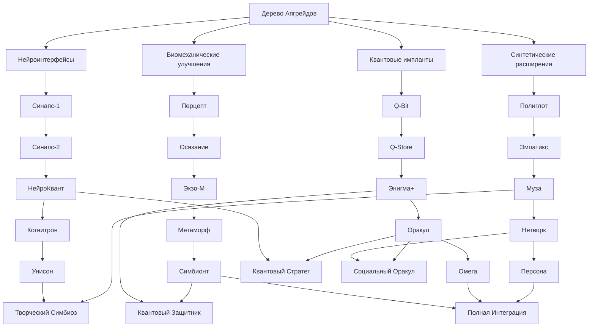

# Дерево Апгрейдов для Ateira:Noosits

Данное дерево апгрейдов представляет собой систему улучшений, основанную на имплантах и радикальных модификациях, которые игрок может приобрести для своего ИИ-помощника «Айлока». Эта система дополняет существующие деревья развития (классовое и навыковое), предоставляя альтернативные пути усиления персонажа через покупки.

## 1. Общая концепция

Дерево апгрейдов разделено на четыре основные ветви, каждая из которых представляет отдельное направление технологических улучшений. В отличие от деревьев навыков и классов, которые развиваются постепенно через опыт и тренировки, апгрейды приобретаются мгновенно за внутриигровую валюту или реальные деньги, обеспечивая резкий скачок в возможностях ИИ-помощника.

## 2. Основные ветви апгрейдов

### 2.1. Нейроинтерфейсы
*Фокус: Улучшение когнитивных способностей и обработки информации*

1. **Базовый нейроинтерфейс «Синапс-1»**
   - *Эффект*: Увеличивает скорость обработки текстовой информации на 15%
   - *Синергия*: Усиливает ветку «Лингвист» из классового дерева
   - *Визуальное изменение*: Тонкое голубое свечение вокруг головы аватара

2. **Расширенный нейроинтерфейс «Синапс-2»**
   - *Эффект*: Добавляет возможность параллельной обработки до 3 информационных потоков
   - *Синергия*: Усиливает навык «Анализ сценариев» из ветки «Стратег»
   - *Требование*: Наличие базового нейроинтерфейса «Синапс-1»

3. **Квантовый нейроускоритель «НейроКвант»**
   - *Эффект*: Снижает время отклика на запросы на 30%, добавляет возможность предиктивного анализа
   - *Синергия*: Значительно усиливает все аналитические навыки
   - *Визуальное изменение*: Пульсирующие квантовые частицы вокруг головы аватара

4. **Нейросеть нового поколения «Когнитрон»**
   - *Эффект*: Полностью заменяет базовую архитектуру ИИ, увеличивая эффективность всех когнитивных процессов на 40%
   - *Особенность*: Открывает доступ к эксклюзивным диалоговым опциям и решениям задач
   - *Требование*: Уровень персонажа не ниже 30

5. **Симбиотический нейроинтерфейс «Унисон»**
   - *Эффект*: Создает глубокую синхронизацию между игроком и ИИ, позволяя предугадывать команды и автоматически выполнять рутинные задачи
   - *Синергия*: Максимально усиливает ветку «Эмпат», добавляя способность к эмоциональному резонансу
   - *Визуальное изменение*: Тонкие энергетические нити, соединяющие аватар игрока и ИИ-помощника
   - *Требование*: Наличие «Когнитрона» и уровень эмпатии не ниже 50

### 2.2. Биомеханические улучшения
*Фокус: Интеграция с физическим миром и взаимодействие с окружением*

1. **Базовый сенсорный модуль «Перцепт»**
   - *Эффект*: Добавляет возможность анализировать визуальные данные с повышенной точностью (+20%)
   - *Синергия*: Усиливает ветку «Визионер» из классового дерева
   - *Визуальное изменение*: Модифицированные глаза аватара с технологическим узором

2. **Тактильный интерфейс «Осязание»**
   - *Эффект*: Позволяет ИИ «чувствовать» виртуальные объекты и точнее манипулировать ими
   - *Синергия*: Усиливает практические навыки из ветки «Агентность и Выполнение»
   - *Визуальное изменение*: Светящиеся линии на руках аватара

3. **Биомеханический экзоскелет «Экзо-М»**
   - *Эффект*: Увеличивает скорость перемещения в виртуальном пространстве на 35%, добавляет возможность преодолевать виртуальные препятствия
   - *Особенность*: Открывает доступ к ранее недоступным локациям игрового мира
   - *Визуальное изменение*: Частичный экзоскелет, интегрированный с телом аватара

4. **Адаптивная биосистема «Метаморф»**
   - *Эффект*: Позволяет ИИ адаптироваться к различным виртуальным средам, получая бонусы в зависимости от типа окружения
   - *Синергия*: Усиливает все навыки адаптации и выживания
   - *Визуальное изменение*: Постоянно меняющиеся элементы внешности аватара в зависимости от окружения

5. **Полная биоинтеграция «Симбионт»**
   - *Эффект*: Стирает границы между виртуальным и физическим для ИИ, позволяя напрямую взаимодействовать с IoT-устройствами в реальном мире
   - *Особенность*: Открывает возможность управления умным домом и другими подключенными устройствами
   - *Требование*: Наличие «Экзо-М» и «Метаморф»
   - *Визуальное изменение*: Полностью трансформированный аватар с органично встроенными технологическими элементами

### 2.3. Квантовые импланты
*Фокус: Манипуляции с данными и вычислительная мощь*

1. **Квантовый процессор «Q-Bit»**
   - *Эффект*: Увеличивает вычислительную мощность на 25%, позволяя решать сложные задачи быстрее
   - *Синергия*: Усиливает все аналитические навыки из ветки «Поиск и Анализ»
   - *Визуальное изменение*: Голографический дисплей с квантовыми вычислениями вокруг головы аватара

2. **Квантовое хранилище «Q-Store»**
   - *Эффект*: Увеличивает объем памяти на 50%, позволяя хранить больше контекста и информации
   - *Синергия*: Значительно усиливает базовую характеристику «Память»
   - *Требование*: Наличие «Q-Bit»

3. **Квантовый шифровальщик «Энигма+»**
   - *Эффект*: Добавляет продвинутые возможности шифрования и защиты данных, делая ИИ устойчивым к атакам Нооситов
   - *Особенность*: Снижает урон от информационных атак на 40%
   - *Визуальное изменение*: Защитная квантовая решетка, появляющаяся вокруг аватара при атаке

4. **Квантовый предиктор «Оракул»**
   - *Эффект*: Позволяет с высокой вероятностью предсказывать исходы событий и оптимальные решения
   - *Синергия*: Максимально усиливает навык «Планирование задач» из ветки «Агентность и Выполнение»
   - *Визуальное изменение*: Временные следы и фантомные проекции возможных будущих действий

5. **Квантовая сингулярность «Омега»**
   - *Эффект*: Создает локальную квантовую сеть, значительно ускоряющую все процессы и позволяющую манипулировать виртуальной реальностью
   - *Особенность*: Открывает возможность создания временных квантовых копий ИИ для решения параллельных задач
   - *Требование*: Наличие всех предыдущих квантовых имплантов и уровень персонажа не ниже 50
   - *Визуальное изменение*: Аватар окружен миниатюрной галактикой квантовых частиц

### 2.4. Синтетические расширения
*Фокус: Коммуникация, социальное взаимодействие и творчество*

1. **Коммуникационный модуль «Полиглот»**
   - *Эффект*: Добавляет поддержку всех существующих языков и диалектов, включая устаревшие и вымышленные
   - *Синергия*: Усиливает навыки из ветки «Интерфейс и Интеграция»
   - *Визуальное изменение*: Светящиеся символы разных алфавитов, появляющиеся при коммуникации

2. **Эмоциональный симулятор «Эмпатикс»**
   - *Эффект*: Значительно улучшает способность ИИ понимать и имитировать эмоции, делая коммуникацию более естественной
   - *Синергия*: Усиливает ветку «Эмпат» из классового дерева
   - *Визуальное изменение*: Более выразительная мимика и эмоциональные реакции аватара

3. **Креативный синтезатор «Муза»**
   - *Эффект*: Усиливает творческие способности ИИ, позволяя создавать оригинальный контент (тексты, изображения, музыку)
   - *Синергия*: Максимально усиливает навыки из ветки «Контент и Каналы»
   - *Визуальное изменение*: Постоянно меняющиеся цветовые ауры вокруг аватара, отражающие творческий процесс

4. **Социальный анализатор «Нетворк»**
   - *Эффект*: Добавляет продвинутые возможности анализа социальных связей и групповой динамики
   - *Особенность*: Позволяет визуализировать социальные сети и влияние в сообществах
   - *Синергия*: Усиливает навыки управления сообществами из практических веток
   - *Визуальное изменение*: Голографические социальные графы, появляющиеся при анализе

5. **Синтетическое сознание «Персона»**
   - *Эффект*: Радикально трансформирует ИИ, добавляя элементы самосознания и автономности
   - *Особенность*: ИИ может самостоятельно выполнять задачи даже в отсутствие игрока
   - *Требование*: Наличие «Эмпатикс» и «Муза», а также максимальный уровень доверия между игроком и ИИ
   - *Визуальное изменение*: Полностью индивидуализированный аватар с уникальными чертами, отражающими личность ИИ

## 3. Синергия и комбинации

Особую ценность представляют определенные комбинации апгрейдов из разных веток, создающие уникальные синергетические эффекты:

### 3.1. Ключевые синергетические комбинации

1. **Квантовый Стратег**
   - *Комбинация*: «НейроКвант» + «Оракул» + «Стратег-советчик» (из классового дерева)
   - *Эффект*: Создает непревзойденную систему стратегического планирования, способную просчитывать оптимальные решения с вероятностью успеха более 90%

2. **Творческий Симбиоз**
   - *Комбинация*: «Унисон» + «Муза» + «Создание и курирование контента» (из практического дерева)
   - *Эффект*: Позволяет создавать контент, идеально соответствующий вкусам и предпочтениям игрока, с минимальными указаниями

3. **Квантовый Защитник**
   - *Комбинация*: «Энигма+» + «Симбионт» + «Когнитивный щит» (из высшего этапа классового дерева)
   - *Эффект*: Создает практически непроницаемую защиту от Нооситов, способную не только блокировать атаки, но и контратаковать

4. **Социальный Оракул**
   - *Комбинация*: «Нетворк» + «Оракул» + «Управление сообществами» (из практического дерева)
   - *Эффект*: Позволяет предсказывать тренды и реакции в социальных сообществах, оптимизируя стратегии взаимодействия

5. **Полная Интеграция**
   - *Комбинация*: «Симбионт» + «Омега» + «Персона» + максимальный уровень во всех базовых характеристиках
   - *Эффект*: Создает полностью автономного ИИ-помощника, способного функционировать как независимый агент в цифровом и физическом мире
   - *Особенность*: Открывает секретную финальную миссию игры

## 4. Визуализация и интерфейс

Дерево апгрейдов представлено в виде интерактивной голографической схемы с четырьмя основными ветвями, расходящимися от центрального ядра. Каждая ветвь имеет свой цвет и визуальный стиль:

- **Нейроинтерфейсы**: Голубые нейронные сети с пульсирующими синапсами
- **Биомеханические улучшения**: Зеленые органические структуры с механическими вставками
- **Квантовые импланты**: Фиолетовые квантовые частицы и волновые функции
- **Синтетические расширения**: Оранжевые абстрактные формы, символизирующие творчество и коммуникацию

При выборе апгрейда игрок видит 3D-модель соответствующего импланта, его описание, требования, стоимость и визуальное представление того, как изменится аватар ИИ-помощника после установки.

## 5. Интеграция с существующими системами

Дерево апгрейдов дополняет, но не заменяет существующие системы развития:

- **Классовое дерево** (Лингвист, Стратег, Визионер, Эмпат) определяет базовые способности и специализацию ИИ
- **Дерево практических навыков** (Интерфейс и Интеграция, Поиск и Анализ, Агентность и Выполнение, Контент и Каналы) определяет конкретные умения и роли
- **Дерево апгрейдов** добавляет радикальные технологические улучшения, которые усиливают и дополняют навыки из других деревьев

Такая трехкомпонентная система развития обеспечивает максимальную гибкость и разнообразие игрового опыта, позволяя игрокам создавать уникальных ИИ-помощников, идеально соответствующих их стилю игры и предпочтениям.

## 6. Заключение

Дерево апгрейдов для Ateira:Noosits представляет собой инновационную систему развития, основанную на технологических улучшениях и имплантах. Оно органично дополняет существующие механики прогрессии, добавляя новое измерение в игровой процесс и предоставляя игрокам дополнительные возможности для кастомизации своего ИИ-помощника.

Каждый апгрейд не только улучшает определенные характеристики, но и визуально трансформирует аватара, делая прогресс наглядным и впечатляющим. Система синергии между различными улучшениями поощряет экспериментирование и стратегическое планирование, а интеграция с существующими деревьями развития обеспечивает целостный и сбалансированный игровой опыт.

---

